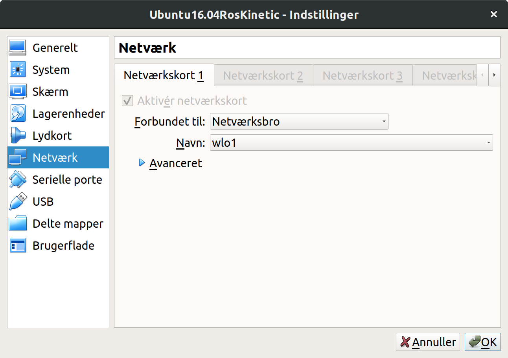

# Tutorial: Launching turtlebot simulation in VM
Objective: This tutorial shows how to launch a VM with a Turtlebot2 simulation to replace the real robot. The simulated robot behaviour is close to the real robot's behaviour, but without the errors such as imprecise encoders. The simulation is running in a tool called Gazebo, which allows you to create artificial worlds and test your robot and behaviour before crashing them in the real world.

NB. Using a vitual machine is far from optimal as the simulation is quite computational expensive. You should therefore consider installing Ubuntu on your computer. 

## Import the virtual machine
Download and import the image of the virtual machine (see link on BlackBoard). The image has been created and tested in Virtualbox

## Setting up the network
In Virtualbox you can specify the network to be in "bridge" mode (Netværksbro in Danish). Go to settings og the VM, Choose "Network" and select "Network bridge". The VM will now appear as an independen computer on your local network.



## Boot up the VM
The username is "Ros"
and the password is "robot"

## Setup IP of ROS
Since the VM is set in bridge mode, it will be connected to the same network as your own computer. Your router probably has a DHCP server, which will provide an IP address for the VM. You can see this IP by bringing up a new terminal (CTRL+ALT+t for a new window, or CTRL+SHIFT+t for a new tab) and type in 
```
ip addr
```
or 
```
hostname -I
```

in this case the IP of the VM is 192.168.87.171.

This ip should be a system variable. In a terminal type:
```
export ROS_IP=192.168.87.171
```

All this can be combined into the following command, where the ip-address is piped to the export statement:
```
hostname -I | export ROS_IP=
```


## Start up the simulation
Open a terminal (CTRL+ALT+t)

start the simulation by launching the gazebo simulator:
```
roslaunch turtlebot_gazebo turtlebot_world.launch
```

I have sometime expericened that Gazebo dies during start-up in the virtual machine. If that happens, just close the terminal and start over.

## Controlling the robot

The simulation is running on ROS Kinetic, where names of topics are slightly different from those on the real robot running on ROS Hydro.

For instance the point-cloud topic is now called `/camera/depth/points`  instead of `/camera/depth_registered/points`, but the `/scan`-topic remain the same.

Steering the robot is still done using the `/mobile_base/commands/velocity`-topic

You can try controlling the robot by opening a new terminal window and publish to this topic:

```
rostopic pub /mobile_base/commands/velocity geometry_msgs/Twist "linear:
  x: 1.0
  y: 0.0
  z: 0.0
angular:
  x: 0.0
  y: 0.0
  z: 0.0" 
```

TIP: You can also start a package called turtlebot_teleop, which allows you to control the robot using your keyboard (also works for the real robot) (You can also use an Xbox or PS joypad)
```
roslaunch turtlebot_teleop keyboard_teleop.launch
```

### Connecting to the robot from Matlab
Find the ip of your host machine using `ip addr` (use ipconfig, if you are running Windows)

Here, we assume the ip of the host is 192.168.1.176

In Matlab you specify the IPs, that you found:
```
setenv('ROS_MASTER_URI','http://192.168.87.171:11311')
setenv('ROS_IP','192.168.87.176')
rosinit('http://192.168.87.171:11311','NodeHost','192.168.87.176');
```
