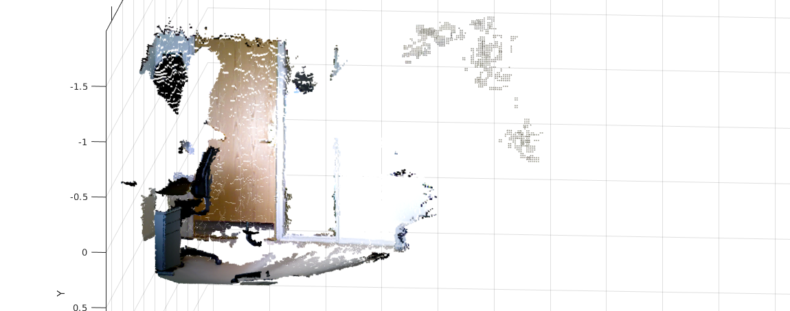

# the /scan topic
Turtlebot published onto a topic called `/scan`, which is of type `sensor_msgs/LaserScan`. This simulates a 1d lidar, but is just a single line from the depth camera.

# Depth image coloured by RGB image using /camera/depth_registered/points

